# DT3D user manual

This manual explains how to create, edit, and view a Digital Twin 3D for Home Assistant (DT3D). It covers spaces, 3D objects, Home Assistant entities, floor-plan tools, measurements, grid configuration, viewports, visualization cards, and performance.

Complete the [setup guide](SETUP_GUIDE.md) before using this manual. For system architecture, source layout, and development instructions, see the [project README](README.md).

## Open the editor

Open the Home Assistant dashboard view that contains the DT3D editing card. A fullscreen **Panel (one card)** view gives the editor the most working space. The [setup guide](SETUP_GUIDE.md#create-the-fullscreen-editor) explains how to create and connect this card.

Keep one editing card for maintaining the digital twin and create separate read-only visualization cards for normal dashboard use.

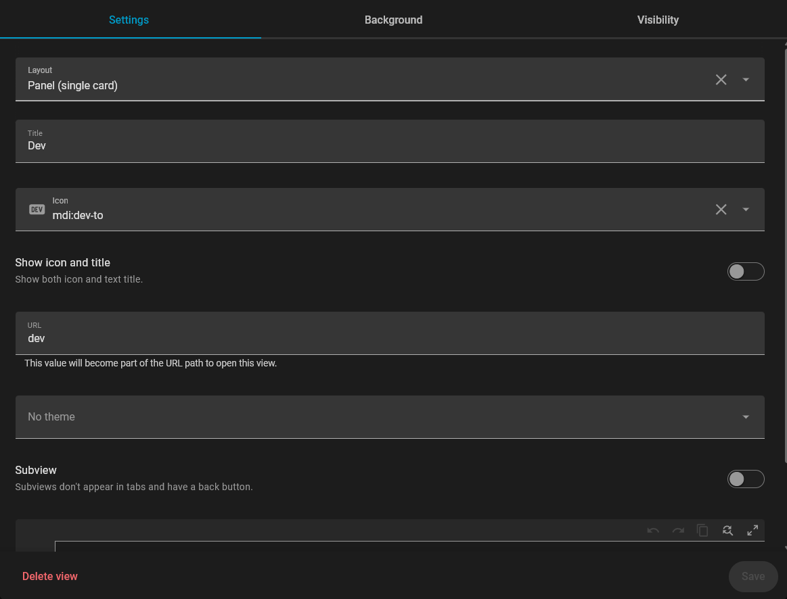

## Using the editor

### Navigate and edit objects

- Orbit, pan, and zoom with the usual mouse/touch gestures. Use the camera button to switch between perspective and orthographic projection.
- Select an object in the object tree, then use **Move**, **Rotate**, or , **Scale** in the left toolbar. The inspector can edit its name, lock state, transform, geometry, material, and type-specific properties.
- Drag tree entries to reorder them or make them children of a group. Grouping is useful for floors, rooms, furniture, and entity layers.
- Right-click an object in the tree to clone or delete it. Locked objects cannot be transformed or dragged.

### Configure the grid

The **Controls** section of the left toolbar contains three grid controls:

- **Snap transforms to grid** (magnet) enables snapping. Translation uses the configured snap size, rotation snaps to 15-degree increments, and scale snaps to increments of 0.1. Wall points also use the configured snap size when this option is active.
- **Toggle grid** shows or hides the editor grid. Grid visibility does not enable or disable snapping.
- **Configure grid** opens the grid configuration dialog.

The grid configuration dialog provides:

| Setting | Default | Description |
| --- | --- | --- |
| Grid size | `200` | Base visible grid extent in meters. The grid expands as the camera rises. |
| Snap size | `0.5` | Translation and wall-placement snap interval in meters. |

Choose **Save** to apply the values. Grid configuration is stored in the current browser, not in the active space, so other devices can use different editor grid settings.

### Manage spaces

A space is an independent scene with its own objects, saved viewports, daylight, tone mapping, and post-processing configuration. Can be used to organize different sections of a home, different floors, or different homes, without the need for a huge scene with all the objects, which can be slow to load and render.

1. Use the selector at the top of the editor to switch spaces.
2. Select **Create space**, enter a name and optional description, and confirm. Use **Space configuration** (cog icon) in the same bar to edit those details later or make the active space the default. Selecting a new default clears the previous default.
3. To copy the active space, select **Clone space**, enter a name, and confirm. The new copy includes the space configuration, every object and its hierarchy, and uploaded geometry.
4. Add or edit objects; changes are synchronized to the backend automatically.
5. Select **Download space (.dt3d)** to save the active space as one portable file. The archive contains the space configuration and object database data, along with uploaded geometry, models, textures, and other persisted assets.
6. Select **Upload space (.dt3d)** to create and open a new space from an archive. Import generates new database IDs, so it does not overwrite the original space.
7. To remove the active space, use **Delete space** beside the selector and confirm. This permanently deletes every object in that space.

Space creation, cloning, import/export, switching, and deletion are hidden when `visualization_only: true`.

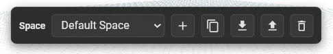

### Add 3D elements

The **Add** section of the left toolbar provides:

- Built-in meshes: cube, sphere, plane, capsule, circle, cone, cylinder, dodecahedron, icosahedron, octahedron, ring, tetrahedron, torus, and torus knot.
- The dedicated **Furniture** section adds a table, chair, couch, bathtub, shelf, or cabinet directly. Each is an independent object with its own inspector controls for overall dimensions and piece-specific construction, such as table legs, chair seat height, couch arms, bathtub walls, shelf count, or cabinet doors.
- Uploaded models: `.gltf`, `.glb`, `.obj`, `.fbx`, `.dae` (Collada), `.stl`, and `.3ds`. Models can also be dragged onto the canvas.
  - Select or drop companion material and texture files with the model, or choose the folder option in the upload menu to preserve their relative paths.
  - Prefer a self-contained `.glb` when possible for reliable results.
- Static lights: point, spot, and rectangular area lights.
- Groups, saved viewports, and Home Assistant entities.

After adding a mesh or furniture object, select it to edit its dimensions, transform, material properties, or apply an image texture. Keep imported geometry and texture sizes modest because they are downloaded and uploaded by each client.

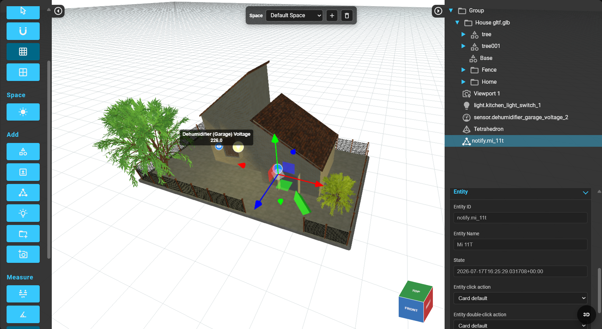

### Add Home Assistant entities

Select **Add entity**, search by entity ID or friendly name, and choose the entity. Position it with the transform controls. Entity visuals update from the Home Assistant state supplied to the card.

| Entity domain | Specialized visualization | Toggle action |
| --- | --- | --- |
| `sensor` | State-aware icon and name/state hover label | No |
| `binary_sensor` | Icon and color derived from the binary state | No |
| `camera` | Round icon with a large still-image preview on pointer hover; requests are serialized and capped at 3 FPS | No |
| `climate` | HVAC-mode color and target temperature while active | No |
| `light` | State/color icon plus a configurable 3D light source | Yes |
| `switch` | State icon and name/state hover label | Yes |
| Any other domain | Generic marker and friendly-name label | No |

All entity domains can use **Open entity** to show Home Assistant's more-info dialog. Card-wide single- and double-click defaults can be `open`, `toggle`, or `nothing`. Each entity can inherit or override those defaults in its inspector; **Toggle** is only offered for `light` and `switch` objects.

### Connect any object to entity states

Select any 3D object and expand **Entity rules** in its inspector. Add as many rules as needed; each rule can use the same entity or a different one. Rules and their original values are saved with the object.

- **Transform action** changes the object's position, rotation, or scale. Choose **On a specific state** to apply the configured transform only while an entity has that state, or **Interpolate from entity value** to map a numeric entity state between the object's original transform and the configured transform. Values outside the configured range are clamped. Rotation is entered in degrees.
- **Color change** applies the configured color while the entity has the specified state and restores the object's original color otherwise.
- **Hide** hides the object while the entity has the specified state and restores its original visibility otherwise.

When multiple active rules affect the same transform, color, or visibility, the last matching rule in the list takes precedence. Disable a rule to keep its configuration without applying it, or remove it to restore the corresponding original value.

### Draw a base floor plan

1. Open **Upload assets** and choose **Add floorplan reference**. Select a 2D floorplan image, click two points whose real separation is known, enter that distance in meters, and choose **Add floorplan**. DT3D creates a horizontal textured plane at the calibrated real-world size. You can also add or import a floor/plane manually.
2. Optionally enable grid snapping and set the required snap size.
3. Select **Draw wall**. Double-click once for the start point, then double-click each following point to draw connected wall segments continuously. Hold **Ctrl** while positioning an endpoint to constrain the segment to X or Z relative to its start; DT3D chooses whichever axis-aligned endpoint is closest to the pointer. End on any part of an existing wall to finish the run, or choose **Exit wall tools**. New T-junctions and wall crossings are split automatically so every join has a real endpoint.
4. When the wall centerlines form a closed loop, DT3D automatically creates a floor surface with that boundary. Moving an endpoint updates the matching automatic floor; opening the loop removes it. Duplicate floors are not created when more walls are connected to the same room.
5. To draw a floor independently, select **Draw floor surface** and double-click each boundary point. Every point is projected onto the first point's Y height, so the surface stays planar. Hold **Ctrl** to constrain the current edge to X or Z relative to the previous floor point; the closest axis is selected. Double-click near the first point after adding at least three points to close and create the floor; press **Escape** to discard an unfinished outline.
6. Select a wall or floor in the canvas or object tree. A selected wall shows blue handles spanning its full height at its start and end; a shared handle uses the tallest connected wall, and a handle changes color when hovered. Double-click a handle and drag the translation control to reshape the wall. Walls sharing that point move together. If the point joins the middle of another wall, DT3D splits that wall at the junction so all connected segments keep moving together.

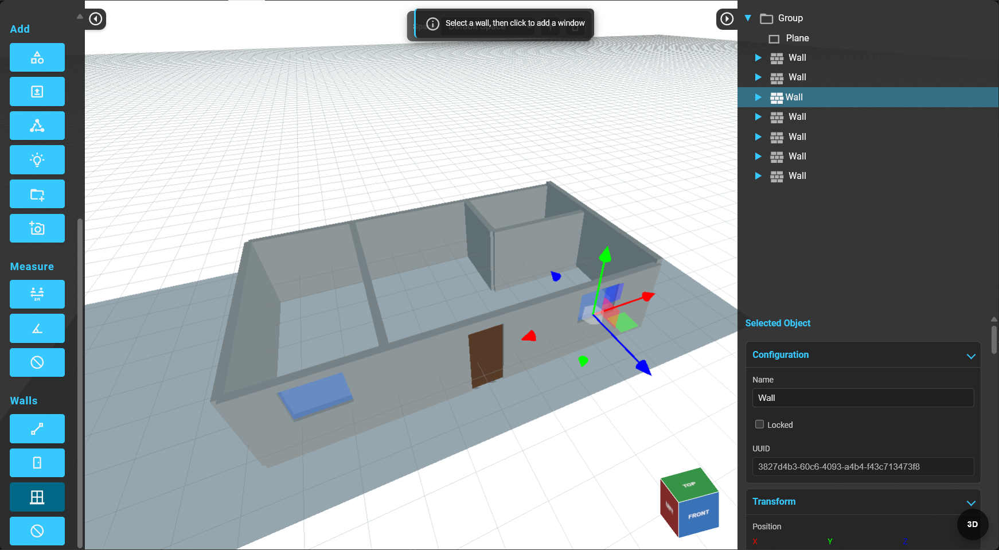

### Add doors, windows, and gates

7. Choose **Add door**, **Add window**, or **Add gate**, then double-click the canvas. The opening is created as a child of that wall.
8. Select the wall, door, window, gate, or floor to edit its transform and material. Choose **Exit wall tools** when finished.

The wall inspector provides height and thickness controls plus an optional baseboard along the bottom. Doors support configurable trim, left/right hinges, inward/outward swing, multiple knob styles, and a positioned glazed opening. Choose a single or double door and select **Hinged** or **Sliding** operation.

Windows support glass tint, opacity, and roughness; configurable frames; split pane grids with custom rows, columns, bar size, and spacing; and horizontal blinds. Hinged windows can use one or two framed sashes. Sliding windows always use two framed sashes on separate tracks; choose the movable left or right sash, which slides across the stationary sash without entering the wall. For doors, windows, and gates, set **Opening (%)** to `0` for closed, `100` for fully open, or an intermediate value for a partial opening. The **Open** toggle is a shortcut for fully open/closed.

Gates can be single or double, with either **Door style** swinging leaves or **Sliding** panels. Choose a solid closed panel or a construction of vertical bars, with configurable bar width and clear spacing. A gate always removes the wall across its full height—there is no wall or lintel above it—even when the visible gate panel is shorter than the wall.

To drive an opening from Home Assistant, search and select its **Openness entity ID**. Door, window, and gate panels, window blinds, shutter doors, and shutter blades each have an independent entity field. The searchable list includes binary sensors, covers, boolean/number helpers, number entities, sensors, and switches. Numeric entity states from `0` to `100` are used as percentages; `on`/`open` and `off`/`closed` are treated as fully open and closed. Cover entities with a numeric `current_position` attribute are also supported. DT3D applies new HA states automatically. Clear an entity ID to use the manual percentage control again. Blind openness is translated to the inverse **% down** value, so a 100%-open entity raises the blind.

Set **Blind location** to mount the blinds on the inside or outside face of the window. Set **Blind position (% down)** to `0` to raise the blinds, `100` to lower them, or any intermediate value for a partial blind opening.

Windows can also have single or double louvered shutter doors. Configure their color and blade count, then use **Door opening (%)** to swing the shutters and **Blade opening (%)** to rotate the blades independently from `0` (closed) to `100` (fully open). These settings and their HA entity bindings are saved with the space.

Hover a wall to see its length or a floor to see its area. The live wall-drawing label and the distance and angle tools in the **Measure** section are useful for checking the plan.

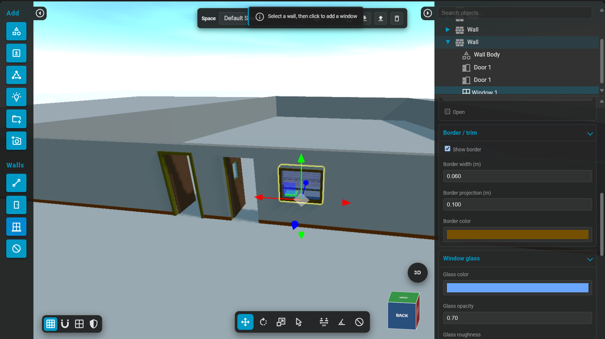

### Set up viewports

A viewport saves the current camera position, target, projection mode, field of view, and zoom.

1. Navigate to the desired camera position and choose **Create viewport**.
2. Rename the new viewport in the object inspector.
3. Move the camera, right-click the viewport in the tree, and use **Update viewport** whenever the saved camera should be replaced.
4. In the same menu, use **Set default viewport** to make it the default for the space. A space has at most one default viewport.
5. Optionally select a different `default_viewport` in a card's configuration. The card-specific choice overrides the space default for that card.

The optional orientation cube is separate from saved viewports. Double-click a cube face to align the camera to the front, back, left, right, top, or bottom.

### Organizing objects with groups

- Create a group to organize objects into a hierarchy or simply tidy up the object tree.
- Groups can be nested, and their transforms affect all children. So you can move or rotate a group to move or rotate all its children at once.

 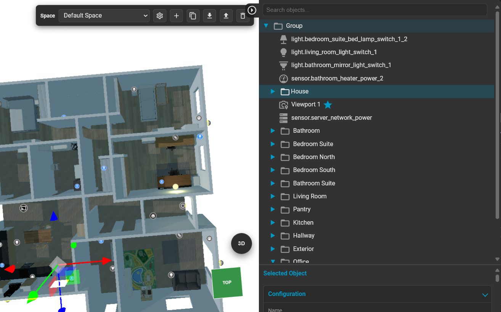

## Space Configuration

 - Open **Space configuration** (cog icon) beside the space selector. The form also contains the space name, description, and default-space checkbox. Its appearance values are saved with the active space and therefore affect every card that displays it:


### Lighting
 - Skybox can be configured, colorized, or disabled.
 - A solid or transparent background can be chosen instead, usefull to allow to view the background of the dashboard.
 - The procedural sky can be enabled or disabled, and optionally follow Home Assistant's local date/time daylight cycle.

 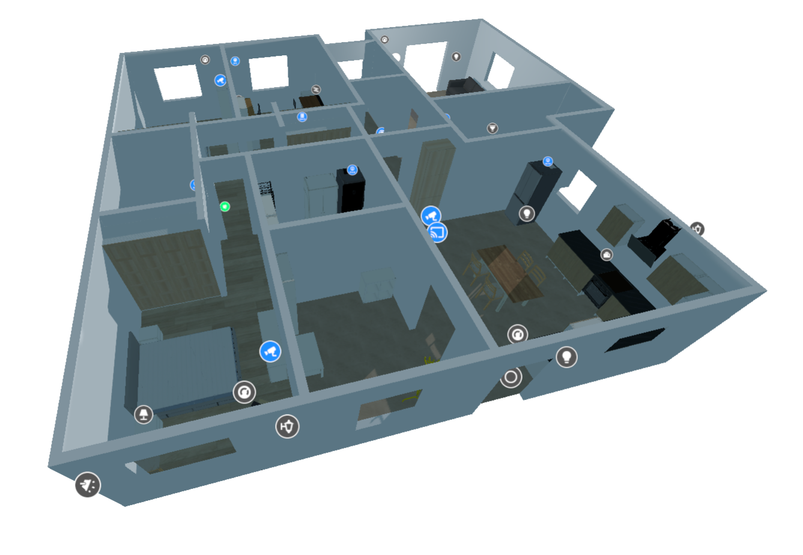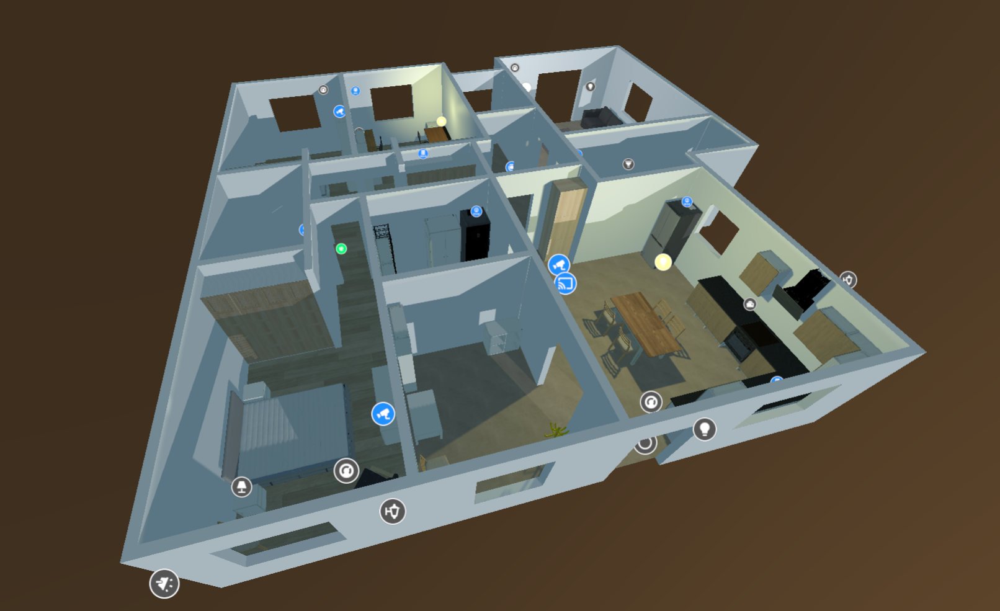

### Post-processing and appearance

| Section | Options |
| --- | --- |
| Tone mapping | None, Linear, Reinhard, Cineon, ACES Filmic |
| Post-processing | Bokeh depth of field, Bloom, GTAO, SSAO, Halftone, Film grain |
| Appearance | Enable or disable the procedural sky, optionally follow Home Assistant's local date/time daylight cycle, and choose a solid-color or transparent background |
| Daylight | Ambient color/intensity, sunlight color/intensity, sun elevation/azimuth |

GTAO and SSAO are mutually exclusive. Post-processing can improve depth and style but is usually the largest GPU cost after high resolution and shadows. Grid visibility, grid size, and snap size are local editor aids rather than space appearance settings.

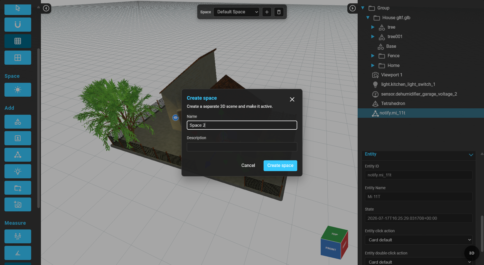

### Measurement tools

- The **Measure** section of the toolbar provides distance and angle measurements.
- Measurement points must be placed on a visible object surface.
- While taking measurement a tooltip guides the user through the process.
- Completed distances and angles remain visible while you add more measurements or switch tools.
- Select **Clear measurements** to leave measurement mode and remove every completed or unfinished measurement.
- Measurements are editor helpers only and are not saved with the space.
- Selecting another tool (e.g. wall tool) exits measurement mode without removing completed measurements.

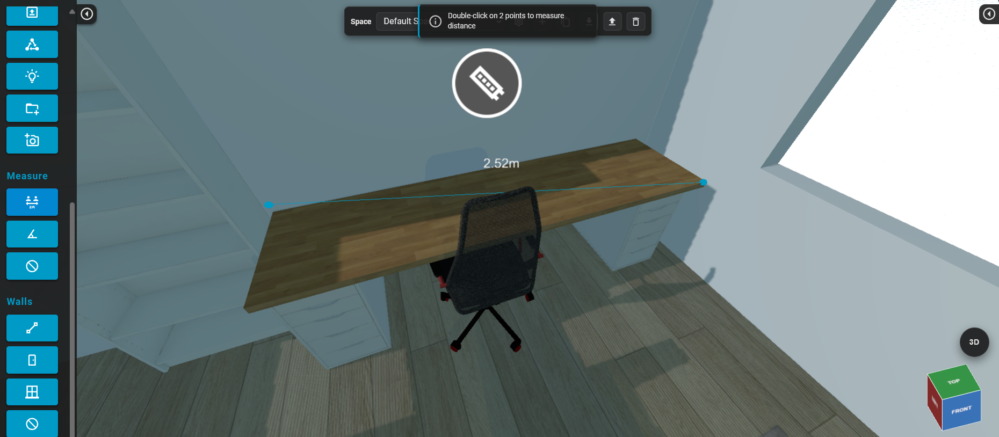

## Configure visualization cards

Create one or more normal dashboard cards with `visualization_only: true`. Editing controls and the object tree are hidden, while camera navigation and entity interactions remain available.

```yaml
type: custom:dt3d-card
address: https://home.example.com
port: 8080
service_key: replace-with-the-backend-service-key
default_space: 7b9b4c3d-choose-a-space-id
default_viewport: 6a8a2d10-optional-viewport-object-id
navigation_controls: orbit
orientation_cube: false
vr_mode: false
ar_mode: false
ar_location_based: false
ar_location_entity: ""
ar_environment_orientation: 0
visualization_only: true
entity_click_action: open
entity_double_click_action: open
general:
  rendering:
    antialiasing: false
    resolution: 0.75
    shadowMap:
      enabled: false
      type: pcf
      quality: medium
  developmentMode:
    enabled: false
```

Configure `default_space` in visualization mode because viewers cannot switch spaces there. Leave `default_viewport` empty to follow the space's default.

### Card configuration reference

| Option | Default | Description |
| --- | --- | --- |
| `address` | `http://localhost` | Backend scheme and hostname, without the API path or trailing port. |
| `port` | `8080` | Exposed backend TCP port. |
| `service_key` | empty | Must exactly match the backend `service_key`. |
| `default_space` | first available | Space ID opened by this card. |
| `default_viewport` | space default | Viewport object ID opened by this card. |
| `navigation_controls` | `orbit` | Camera interaction style: `orbit`, `map`, or `fly`. |
| `orientation_cube` | `false` | Shows the camera orientation cube. |
| `vr_mode` | `false` | Shows a VR button when immersive VR is available through WebXR. |
| `ar_mode` | `false` | Shows an AR button when immersive AR is available through WebXR. |
| `ar_location_based` | `false` | Centers AR on a Home Assistant location entity. |
| `ar_location_entity` | empty | Entity ID with numeric `latitude` and `longitude` attributes. |
| `ar_environment_orientation` | `0` | Front-of-environment bearing, clockwise in degrees from geographic north. |
| `visualization_only` | `false` | Hides all editing and space-management controls. |
| `entity_click_action` | `nothing` | `open`, `toggle`, or `nothing`. |
| `entity_double_click_action` | `open` | `open`, `toggle`, or `nothing`. |
| `general.rendering.antialiasing` | `false` | Smooths geometry edges; changing it recreates the WebGL renderer. |
| `general.rendering.resolution` | `1` | Internal scale: `1`, `0.75`, or `0.5`. |
| `general.rendering.shadowMap.enabled` | `false` | Enables shadows for compatible lights and meshes. |
| `general.rendering.shadowMap.type` | `pcf` | `basic`, `pcf`, `pcf_soft`, or `vsm`. |
| `general.rendering.shadowMap.quality` | `medium` | `very_high`, `high`, `medium`, or `low`; uses separate directional and point-light resolutions. |
| `general.developmentMode.enabled` | `true` | Shows connection status and build timestamp. Disable for normal dashboards. |

Shadow-map quality maps to directional/point-light sizes as follows: `very_high` = 8192/1024, `high` = 4096/512, `medium` = 2048/256, and `low` = 1024/128. The renderer automatically falls back to a supported power-of-two size when the GPU texture or cubemap limit is lower.

Connection, antialiasing, resolution, shadow maps, and development mode are per-card. Tone mapping, post-processing, and daylight are per-space.

WebXR immersive modes require a supported browser/device and HTTPS. During an AR session, the sky is hidden and the scene background is forced transparent; the saved space appearance is restored when AR ends. Location-based AR also requires device geolocation and absolute-orientation permission. It converts the device-to-entity geographic offset to meters and aligns the space using the configured bearing.

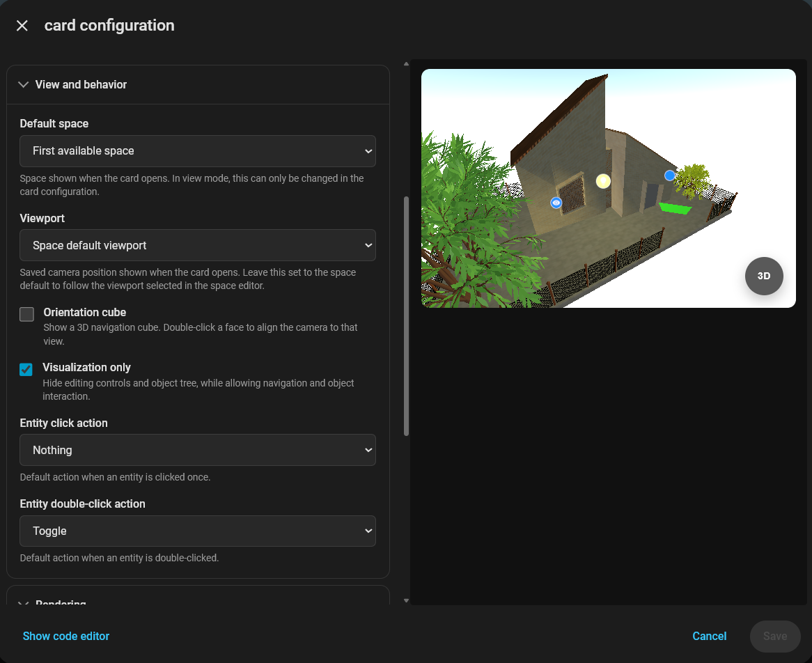

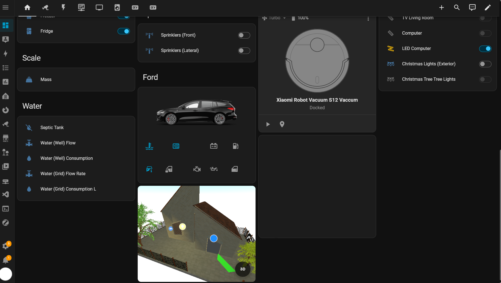

## Data synchronization

- While the system is loading or storing data in the server, a progress indicator is shown in the bottom right corner.
- If home assistant is closed before the data is fully synchronized, the changes made can be lost.

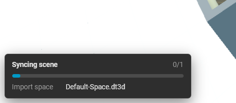

## Performance optimization

- The digital twin 3D renderer is GPU-bound. The following settings and practices can improve performance on low-end devices, integrated GPUs, and mobile phones.
- Start with the following profile on phones, wall tablets, and integrated GPUs:

```yaml
general:
  rendering:
    antialiasing: false
    resolution: 0.75
    shadowMap:
      enabled: false
      type: basic
      quality: low
  developmentMode:
    enabled: false
```

Then optimize in this order:

1. Lower `resolution` from `1` to `0.75`, then `0.5`. This usually gives the largest improvement with the smallest visual change.
2. Disable shadow maps. If shadows are required, use `basic` first, limit the number of shadow-casting lights, and disable **Cast shadows** on lights and meshes that do not need them. - Select a mesh and expand **Shadows** in the object inspector. **Cast shadows** controls whether the mesh projects a shadow, while **Receive shadows** controls whether shadows are drawn on its surface.
3. Disable post-processing in **Space configuration**. Avoid stacking several effects; GTAO and SSAO cannot be enabled together.
4. Keep antialiasing off on high-DPI displays. Test it only after resolution and shadows are acceptable.
5. Prefer optimized `.glb` models, fewer polygons/materials, compressed textures, and fewer camera entities. Camera objects load and refresh their still images only while their pointer-hover preview is visible.
6. Split very large homes into separate spaces or dashboard views so clients do not render everything at once.

## Troubleshooting

- **An object cannot be moved or reordered:** select it and disable its locked state in the inspector.
- **A measurement point is not added:** double-click a visible object surface. Clicking empty scene space does not create a measurement point.
- **Grid settings differ on another device:** grid configuration is stored locally in each browser and is not part of the space.
- **Imported model has missing materials/textures:** use a self-contained `.glb` or apply a texture through the object inspector.
- **The scene is slow on a phone or wall panel:** start with the profile in [Performance optimization](#performance-optimization), then reduce model and texture complexity.

For card loading, connection, authorization, mixed-content, certificate, or space-list problems, see [Setup troubleshooting](SETUP_GUIDE.md#setup-troubleshooting).
