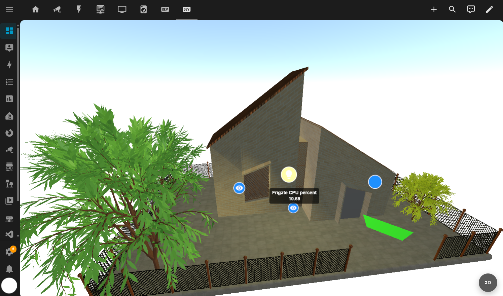

# Digital Twin 3D for Home Assistant (DT3D)

[](https://my.home-assistant.io/redirect/supervisor_add_addon_repository/?repository_url=https%3A%2F%2Fgithub.com%2Ftentone%2Fdt3d-ha)
[](https://my.home-assistant.io/redirect/hacs_repository/?owner=tentone&repository=dt3d-ha&category=plugin)

 - DT3D is a Home Assistant addon and dashboard card to create a digital twin of a home.
 - Features a integrated 3D editor to create and modify the digital twin, add 3D elements, and link them with HA entities.
 - The project is split into a HA frontend card and a Home Assistant app/add-on that stores 3D scene data.
 - The system allows to create multiple spaces (environments) in the same deployment.
 - For installation and connection instructions, see the [setup guide](SETUP_GUIDE.md).
 - For end-user instructions, see the [user manual](MANUAL.md).




## System architecture

 - DT3D uses a dedicated addon to store  3D scene data separate from Home Assistant entity.
 - The frontend card communicates with the addon directly through REST API calls.
    - It is required that the addon is reachable from the Home Assistant frontend, and complies with the CORS policy.
 - Frontend card: renders the scene, provides the editor, consumes Home Assistant entity states, opens entity dialogs, and calls Home Assistant services in the same way as any other custom frontend card.
 - Backend app/add-on provides the 3D space API and persists spaces, object hierarchies, transforms, materials, viewports, space configuration and uploaded geometry.
 -  The frontend stores only local editor preferences, such as grid and collapsed panel state, in browser storage.
 - Persistent spaces and objects are synchronized to the backend.
 - Home Assistant entity state is consumed live and is not copied into the DT3D database as an alternative entity registry.


## Frontend Card

- Frontend card is built with TypeScript and uses [Lit](https://lit.dev/) and [three.js](https://threejs.org/).
- Vite library-mode build producing one ES module
- The built custom element is registered as `dt3d-card` and is used in Home Assistant as `custom:dt3d-card`.

### Build and test
 - Setup node.js and npm on your development machine.
 - Install dependencies and build the frontend card using `npm install` and `npm run build` in the `frontend` directory.
 - The built bundle is written to `frontend/dist/dt3d-card.js`
 - To test copy the bundle to Home Assistant's `/config/www` directory and register it as a JavaScript module resource in **Settings → Dashboards → three-dot menu → Resources**:
 - Hard-refresh the browser after replacing the bundle to ensure the new version is loaded.

### Setup
 
 - Frontend card can be configured trough the GUI or using YAML in a dashboard view.
 - Use HTTPS for the backend when the Home Assistant page uses HTTPS; browsers block calls from a secure page to an insecure backend.
 - Sample configuration for a dashboard view:

```yaml
type: custom:dt3d-card
address: http://homeassistant.local
port: 8080
service_key: <secret> # Same as the backend addon configuration
navigation_controls: orbit
visualization_only: false # Set to true to disable editing and object creation
general:
  developmentMode:
    enabled: false
```


## Backend Addon

- Addon is built using Go with Gin and GORM alongside a SQLite database.
- Home Assistant base container on Alpine Linux
- Header-based API authentication with `X-DT3D-Service-Key`
- Optional TLS using a configured certificate/key pair or a generated self-signed certificate

### Build and test
 - Go with the version supported by `addon/backend/go.mod`.
 - Can run directly from the development machine with `go run main.go` or using docker.
 - Alternatively copy the content from `addon/*` to a Home Assistant `/addons/dt3d` directory and install as a local app/add-on.
 - Open **Settings → Apps** (or **Settings → Add-ons** on older versions), open the store, and reload it from the three-dot menu.
 - Open the local **DT3D** entry and select **Install** or **Rebuild**.
 - Configure at least a non-empty `service_key`, then start the app/add-on.
 - There is a deployment bash script that copies the backend over SSH, reloads the store, and then installs, rebuilds, or restarts the local app/add-on `./addon/deploy.sh <ssh-user> '<ssh-password>' [ha-host] [ssh-port]`
    - It requires the Home Assistant **Terminal & SSH** app/add-on and `sshpass` on the development computer.


### Configuration
 - The addon configuration can be set in the Home Assistant GUI or using YAML.
 - For HTTPS and certificates, follow the [network and TLS section of the setup guide](SETUP_GUIDE.md#network-and-tls-setup).
 - Here is a sample configuration for the backend add-on.
```yaml
port: 8080
service_key: <secret> # Can be anything, used for header-based authentication
ssl_certificate: ""
ssl_key: ""
use_self_signed_certificate: false
```


### Data Structure

 - Inside the Home Assistant app/add-on:
 - SQLite uses `data.db` in the backend process's working directory. In the current container image that directory is `/app`.
 - Generated or normalized TLS files live under `/data`.
 - Imported binary geometry lives under `/data/dt3d-geometries`.
 - Certificates mounted from Home Assistant are available under `/ssl`.
 - The frontend can download and upload spaces as portable `.dt3d` ZIP
   archives. Each archive contains a versioned `space.json` database snapshot
   and the space's persisted assets under `assets/`.

## Repository structure

```text
.
├── addon/
│   ├── backend/
│   │   ├── handlers/       HTTP authentication and space/object routes
│   │   ├── models/         GORM database models
│   │   ├── repository/     SQLite persistence
│   │   └── service/        Space and object business logic
│   ├── config.yaml         Home Assistant app/add-on metadata and options
│   ├── Dockerfile          Home Assistant app/add-on image
│   └── deploy.sh           SSH-based local deployment helper
├── frontend/
│   ├── src/
│   │   ├── components/     Card, editor UI, menus, tree, and inspectors
│   │   ├── editor/         Scene, renderer, walls, materials, and measurements
│   │   ├── objects/        Persistable 3D and Home Assistant entity objects
│   │   ├── service/        DT3D API client and scene synchronization
│   │   └── locale/         UI strings
│   └── vite.config.js      Single-module production build
├── sample/                 Sample 3D assets
├── MANUAL.md               End-user documentation
├── SETUP_GUIDE.md          Installation and connection documentation
└── README.md               Architecture and development documentation
```

## Documentation

- [Setup guide](SETUP_GUIDE.md)
- [User manual](MANUAL.md)
- [Home Assistant custom app repositories](https://developers.home-assistant.io/docs/apps/repository/)
- [Home Assistant dashboard views](https://www.home-assistant.io/dashboards/views/)
