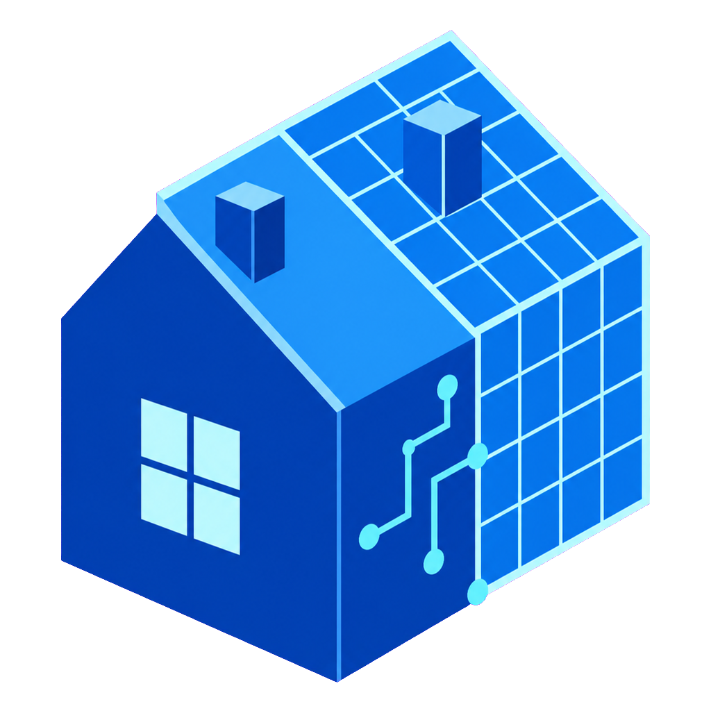
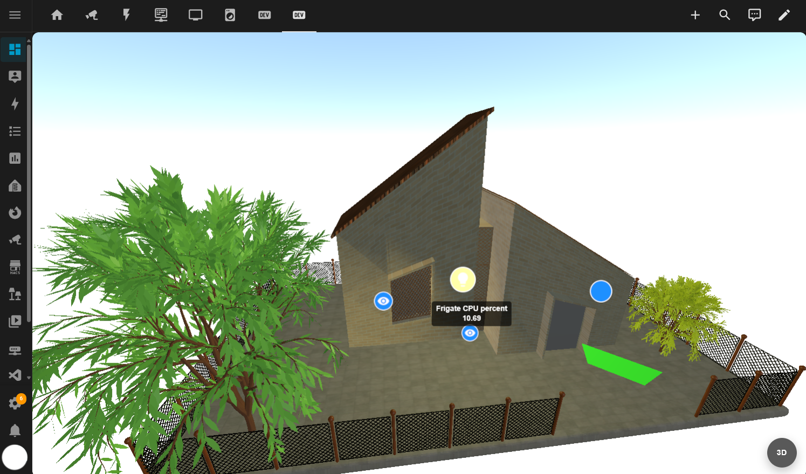

#  DT3D - 3D Digital Twin for Home Assistant

[](https://my.home-assistant.io/redirect/supervisor_add_addon_repository/?repository_url=https%3A%2F%2Fgithub.com%2Ftentone%2Fdt3d-ha) [](https://my.home-assistant.io/redirect/hacs_repository/?owner=tentone&repository=dt3d-ha&category=plugin)

- DT3D is a Home Assistant addon and dashboard card to create a digital twin of a home.
- Features a integrated 3D editor to create and modify the digital twin, add 3D elements, and link them with HA entities.
- The project is split into a HA frontend card and a Home Assistant app/add-on that stores 3D scene data.
- The system allows to create multiple spaces (environments) in the same deployment.
- For installation and connection instructions, see the [setup guide](SETUP_GUIDE.md).
- For end-user instructions, see the [user manual](MANUAL.md).




## System architecture

- DT3D uses a dedicated addon to store 3D scene data separate from Home Assistant entity.
- The frontend card communicates with the addon directly through REST API calls.
  - It is required that the addon is reachable from the Home Assistant frontend, and complies with the CORS policy.
- Frontend card: renders the scene, provides the editor, consumes Home Assistant entity states, opens entity dialogs, and calls Home Assistant services in the same way as any other custom frontend card.
- Backend app/add-on provides the 3D space API and persists spaces, object hierarchies, transforms, materials, viewports, space configuration and uploaded geometry.
- The frontend stores editor preferences and caches the space list, each space's object hierarchy, and geometry in IndexedDB. Cards and the configuration editor share this cache for the same backend and service key, including pending list/object requests. The list is reused for up to one minute; the next load after that checks the backend, and object trees are reused while their backend cache version matches. Older backends without cache versions also cache trees for up to one minute. Successful edits invalidate the relevant cached data immediately. Browser reloads retain the cache, and unavailable browser storage falls back to network loading.
- Persistent spaces and objects are synchronized to the backend.
- Home Assistant entity state is consumed live and is not copied into the DT3D database as an alternative entity registry.

## Frontend Card

- Frontend card is built with TypeScript and uses [Lit](https://lit.dev/) and [three.js](https://threejs.org/).
- Vite library-mode build producing one ES module
- The built custom element is registered as `dt3d-card` and is used in Home Assistant as `custom:dt3d-card`.

### Build and test

- Setup node.js and npm on your development machine.
- Install dependencies and build the frontend card using `npm install` and `npm run build` in the `frontend` directory.
- The built bundle is written to `frontend/dist/dt3d-card.js`
- To test copy the bundle to Home Assistant's `/config/www` directory and register it as a JavaScript module resource in **Settings → Dashboards → three-dot menu → Resources**:
- Hard-refresh the browser after replacing the bundle to ensure the new version is loaded.

### Setup

- Frontend card can be configured trough the GUI or using YAML in a dashboard view.
- Use HTTPS for the backend when the Home Assistant page uses HTTPS; browsers block calls from a secure page to an insecure backend.
- Sample configuration for a dashboard view:

```yaml
type: custom:dt3d-card
address: http://homeassistant.local
port: 8080
service_key: <secret> # Same as the backend addon configuration
navigation_controls: orbit
vr_mode: false # Show VR entry on supported WebXR devices
ar_mode: false # Show AR entry on supported WebXR devices
ar_location_based: false # Anchor AR using a Home Assistant location entity
ar_location_entity: ""
ar_environment_orientation: 0 # Clockwise degrees from geographic north
visualization_only: false # Set to true to disable editing and object creation
hide_occluding_walls: true # Make nearby walls and their attached openings transparent in low-angle visualization views
general:
  developmentMode:
    enabled: false
```

VR and AR require a browser/device with immersive WebXR support and a secure Home Assistant page (HTTPS). In AR, DT3D automatically hides the sky and uses a transparent scene background so the device camera feed remains visible. Location-based AR additionally requires device location and compass permission. The selected entity must expose numeric `latitude` and `longitude` attributes.


## Backend Addon

- Addon is built using Go with Gin and GORM alongside a SQLite database.
- Home Assistant base container on Alpine Linux
- Header-based API authentication with `X-DT3D-Service-Key`
- Optional TLS using a configured certificate/key pair or a generated self-signed certificate

### Build and test

- Go with the version supported by `addon/backend/go.mod`.
- Can run directly from the development machine with `go run main.go` or using docker.
- Alternatively copy the content from `addon/*` to a Home Assistant `/addons/dt3d` directory and install as a local app/add-on.
- Open **Settings → Apps** (or **Settings → Add-ons** on older versions), open the store, and reload it from the three-dot menu.
- Open the local **DT3D** entry and select **Install** or **Rebuild**.
- Configure at least a non-empty `service_key`, then start the app/add-on.
- There is a deployment bash script that copies the backend over SSH, reloads the store, and then installs, rebuilds, or restarts the local app/add-on `./addon/deploy.sh <ssh-user> '<ssh-password>' [ha-host] [ssh-port]`
  - It requires the Home Assistant **Terminal & SSH** app/add-on and `sshpass` on the development computer.

### Configuration

- The addon configuration can be set in the Home Assistant GUI or using YAML.
- For HTTPS and certificates, follow the [network and TLS section of the setup guide](SETUP_GUIDE.md#network-and-tls-setup).
- Here is a sample configuration for the backend add-on.

```yaml
port: 8080
service_key: <secret> # Can be anything, used for header-based authentication
ssl_certificate: ""
ssl_key: ""
use_self_signed_certificate: false
```

### Data Structure

- Inside the Home Assistant app/add-on:
- SQLite uses `/data/data.db`, inside Home Assistant's persistent add-on data volume. It survives add-on restarts, rebuilds, and upgrades.
- Generated or normalized TLS files live under `/data`.
- Imported binary geometry lives under `/data/dt3d-geometries`.
- Certificates mounted from Home Assistant are available under `/ssl`.
- The frontend can download and upload spaces as portable `.dt3d` ZIP archives. Each archive contains a versioned `space.json` database snapshot and the space's persisted assets under `assets/`.

### Browser scene cache

- IndexedDB database `dt3d-ha-space-cache` stores the lightweight space list, complete snapshots of spaces opened by the client, and their binary geometry. Snapshots include configuration, every object record and parent ID, sibling ordering, transforms, materials, embedded textures, entity rules, and other stored attributes. Cache namespaces separate backend addresses and service keys.
- `GET /api/spaces` (also `?include_objects=false`) returns metadata with empty `object_instances` arrays. The client displays the cached list immediately and refreshes it in the background. `?include_objects=true` remains available for callers that need all objects.
- `GET /api/spaces/:spaceID/version` returns only `id` and `cache_version`. Versions increase transactionally for object creation, updates and subtree deletion, space metadata/configuration changes, and changes to the default space. Geometry uploads use immutable IDs; linking a new geometry to an object increments the scene version.
- `GET /api/spaces/:spaceID` reads configuration, objects and version in one database transaction. `SpaceApi.loadSpaceState()` checks the version directly on the server and downloads this snapshot only when the cached version differs or is missing.
- A loaded cached scene stays visible while a changed scene and its resources are prepared in a detached object tree. The replacement is applied after its resources finish loading. Editor controls and saves remain disabled until validation and resource loading complete. A failed refresh preserves the displayed scene and offers Retry; offline scenes remain viewable with editing disabled.
- Cached lists and snapshots do not expire after one minute. Local edits retain the previous snapshot for display while invalidating its version; deleting a space removes its cached snapshot, list entry and geometry. Browsers can still evict storage, and a missing or unavailable IndexedDB cache falls back to network loading. Older object-only cache records are replaced by complete snapshots on the next successful load.
- Update the frontend and backend together to enable the version endpoint. Run `npm run test:space-cache` in `frontend` and `go test ./...` in `addon/backend` to verify the cache and API contract.

### Automatic asset compression

- Imported meshes already used Draco (`DT3DGEO2`) on upload. Loading a space now also detects older raw binary (`DT3DGEO1`) and inline geometry, prepares compressed replacements, and saves them automatically when editing is allowed. Material groups, attribute types, UVs and draw ranges are retained. Unsupported geometry and morph targets use the lossless raw fallback. Procedural walls, floors and furniture continue to store compact construction parameters.
- Static material images are automatically encoded to KTX2/Basis UASTC in a background worker, with mipmaps when requested by the original texture. Images larger than 2048 pixels on either side are resized proportionally. Color maps use sRGB; data and normal maps retain linear sampling. The loader selects a GPU format supported by the device (such as BC7, ASTC or ETC2); devices without compressed-texture support fall back to RGBA. Video, dynamic canvas, HDR, cube and other special textures are kept unchanged, as are images that cannot be read because of cross-origin restrictions or codec failures.
- Geometry and textures carry versioned `userData.dt3dCompression` metadata. Saved mesh records also carry `geometryCompression`; textures distinguish portable compression from actual `gpuCompressed` storage. The binary format and image container determine compression status, rather than trusting a flag alone. Unchanged Draco data and KTX2 textures are reused; editing a geometry buffer invalidates its saved revision.
- KTX2 bytes are embedded in material image records, so existing space snapshots, material libraries and `.dt3d` archives retain portable textures across different GPUs. IndexedDB caches these snapshots, uploaded geometry immediately, and derived compression results by content. The optional derived cache is bounded to 64 entries of at most 16 MiB each and is isolated by backend/service key. Read-only and offline views can optimize locally without writing to the server. Browser eviction or storage failures may require a download or recompression.
- Both import decoders and texture codecs ship inside `dt3d-card.js`, including their WASM; no codec CDN is needed. Draco reduces geometry download/storage size, not its decoded GPU memory. GPU texture compression reduces texture memory; it does not reduce polygon counts or draw calls.


## Repository structure

```text
.
├── addon/
│   ├── backend/
│   │   ├── handlers/       HTTP authentication and space/object routes
│   │   ├── models/         GORM database models
│   │   ├── repository/     SQLite persistence
│   │   └── service/        Space and object business logic
│   ├── config.yaml         Home Assistant app/add-on metadata and options
│   ├── Dockerfile          Home Assistant app/add-on image
│   └── deploy.sh           SSH-based local deployment helper
├── frontend/
│   ├── src/
│   │   ├── components/     Card, editor UI, menus, tree, and inspectors
│   │   ├── editor/         Scene, renderer, walls, materials, and measurements
│   │   ├── objects/        Persistable 3D and Home Assistant entity objects
│   │   ├── service/        DT3D API client and scene synchronization
│   │   └── locale/         UI strings
│   └── vite.config.js      Single-module production build
├── sample/                 Sample 3D assets
├── MANUAL.md               End-user documentation
├── SETUP_GUIDE.md          Installation and connection documentation
└── README.md               Architecture and development documentation
```

## Documentation

- [Setup guide](SETUP_GUIDE.md)
- [User manual](MANUAL.md)
- [Home Assistant custom app repositories](https://developers.home-assistant.io/docs/apps/repository/)
- [Home Assistant dashboard views](https://www.home-assistant.io/dashboards/views/)
